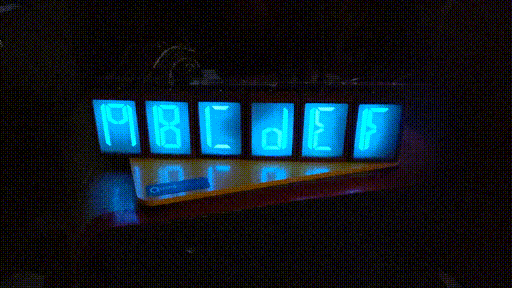

# alienFontDisplay
Display made of six eight-segment EL display units

## TBD
* BOM
* WiFi interface board
* Firmware
* Tests
* Example code
* Documentation

### Display Pinout

### Alphanumeric Font

### Single Display and Driver Board

### Driver PCB

### Schematic

=========================

* Blue, Alien Font, Russian/Soviet Electroluminescent Display

* IEL-O-VI C63.396.208-02

* pinout
  - 1: common
  - 2: bottom horizontal (S)
  - 3: bottom right angled (M)
  - 5: n/c?
  - 7: left vertical (L)
  - 8: bottom left angled (M)
  - 11: top right angled (M)
  - 14: left vertical (L)
  - 17: top horizontal (S)
  - 20: top left angled (M)

* capacitance (estimates)
  - S: 55 pFd
  - M: 90 pFd
  - L: 170 pFd

* notes
  - ~200V @ 400Hz
  - not squarewave -- filter or triangle wave for constant dv/dt
  - less bright at 50Hz, but last longer
  - need current limiting resistor if power source has low internal resistance
    * e.g., 330K ohm @ 220V @ 50Hz
  - 500 Hrs lifespan
  - sine/square voltage up to 250V and 400Hz-5KHz
  - decay time fractions of msec
  - at least 6usec pulse
  - no loss of brightness in pulses of 100usec at constant duty cycle
  - most of drop in brightness occurs in first 200 hours of operation
    * relatively flat after that
  - for best lifetime, maintain constant frequency and reduce voltage
  - use current limiting resistor for supplies with internal resistance less than 1Kohm
  - add 0.03-0.05ufd caps in parallel with electrodes to improve reliability
  - nomenclature
    * I: indicator
    * EL: electroluminescent
    * O: one color
    * VI: size (34x40mm)
    * number of dots indicate brightness
  - constant power mode
    * 220V @ 400Hz
  - constant brightness mode
    * 175-250V @ 1200Hz
  - 0.5-3 mA current
  - DC will destroy the display
  - can't multiplex displays -- need driver for each segment

* Links
  - https://www.nixology.uk/el-displays/
  - http://www.155la3.ru/electroluminescent.htm?fbclid=IwAR3kzInl6R3qaqCM56aDhy-eqRuBEZQ2xA1R94jkRoaB9Y2xDsH_GoB88GI
  - https://www.youtube.com/watch?v=p6mNbgtnFK8
  - http://lampes-et-tubes.info/cd/cd143.php?l=e
  - http://www.nedopc.org/forum/viewtopic.php?f=65&t=11093

* Sparkfun EL Inverter (COM-10469 retired)
  - input: 12VDC
  - output: 70-110V (90V typ)
  - frequency: 800-3500Hz (2000Hz typ)

* Sparkfun EL Inverter (sourced from Amazon)
  - input: 5VDC
  - output: 225VAC (in afd circuit)
  - frequency: 5-7KHz (in afd circuit)

=======================================================================================
* SmartSocket for Alien Font displays
  - use same protocol on daisy-chained 9600 baud RS232 (3v3?)
    * http://tayloredge.com/reference/Circuits/1386SmartSocket/SmartSockets.pdf
  - build single-sided PCB that fits on back of display units
    * drive each segment individually
    * use common HV PSU
    * use circuits from SparkFun boards as they have been tested and shown to work
  - need to select a PIC to use as the on-board controller
    * PIC18F16Q41: same as PIC18F16Q40 but has an opAmp
    * PIC18F16Q40:
      - 14pin device has six GPIOs on PortA and another six on PortC
      - has 1/2 UARTs
      - 64KB program FLASH, 4KB SRAM, 512B EEPROM
      - 18x GPIO, 2/3x 8b timers, 17x channels of 12b ADC, 2x 8b DACs, 4x DMA
      - 32b CRC with scanner, vectored interrupts, temperature indicator, NCO, PWM/CCP
      - C compiler
        * CCS: http://www.ccsinfo.com -- $200-$500
        * Hi-Tech: http://www.htsoft.com -- bought by Microchip
        * Microchip: http://www.microchip.com -- free student mode
        * MPLAB C18: microchip
        * MikroC: free student version with limits
        * https://www.microchip.com/en-us/development-tool/C18
      - $1.5 at Mouser (in stock)
        * PIC18F16Q40-E/SO
        * https://www.mouser.com/ProductDetail/Microchip/PIC18F16Q40-E-SO?qs=sGAEpiMZZMv0NwlthflBi%252BydFA3s6SRqoyEH6IOSDHM%3D
      - example: https://github.com/microchip-pic-avr-examples/pic18f16q40-quadrature-decoder
        * RA2: UART Tx programmer?
        * RB7: UART Tx
        * RB5: UART Rx
        * RB4, RB6, RA4, RA5, RC0-RC7: GPIO
      - PPS re-mappable input signals can be moved from default locations to other ports
        * UART outputs: DTR1, RTS1, TX1, DTR2, RTS2, TX2, DTR3, RTS3, TX3
        * UART inputs: RX1, CTS1, RX2, CTS2, RX3, CTS3 
      - pin allocation table (default)
        * RB5: RX1
        * RB7: CTS1
        * RC1: RX2
        * RC2: CTS2
        * RC3: RX3
        * RC5: CTS3
  - use shift registers?
  - use I2C port expander?

* display unit dimensions, pin and threaded spacer locations are not consistent across instances

* Use SparkFun EL boards for proof of concept testing

* EL Sequencer v23
  - https://www.sparkfun.com/products/12781
  - http://cdn.sparkfun.com/datasheets/Components/EL/SparkFun_EL_Sequencer_v23.pdf
  - ATMega328P processor on-board
    * use "Arduino Duemilanove or Diecimila" board with FTDI USB dongle
  - Gets HV from Sparkfun EL Inverter
    * not ideal -- need higher voltage and better frequency
  - Drives HV to all segments of all displays
    * EL Escudo Dos pulls display commons to HV_GND
  - D2-D9 used to drive EL_A-EL_H
    * EL_A: pin 2
    * EL_B: pin 3
    * EL_C: pin 7
    * EL_D: pin 8
    * EL_E: pin 11
    * EL_F: pin 14
    * EL_G: pin 17
    * EL_H: pin 20
  - Sends six (active high) TTL signals to EL Escudo Dos to enable each display
    * ADC_0 (JP4:2): display #1
    * ADC_1 (JP4:7): display #2
    * ADC_2 (JP2:8): display #3
    * ADC_3 (JP2:7): display #4
    * ADC_4 (JP2:6): display #5
    * ADC_5 (JP2:5): display #6

* EL Escudo Dos
  - https://www.sparkfun.com/products/10878
  - https://cdn.sparkfun.com/datasheets/Components/EL/EL_Escudo_Dos/EL%20Escudo%20Dos%20v21.pdf
  - Pulls display common lines (pin 1) down to HV_GND
  - EL_H: display #1 ... EL_C: display #6
  - gets HV_GND and TTL display unit selector signals from EL Sequencer
  - all SCRs have common HV connected to their tabs
    * and they have individual outputs to load and ground
  - need to cut HV to tabs and connect them to the display common signals
    * and short all load outputs to HV_GND
